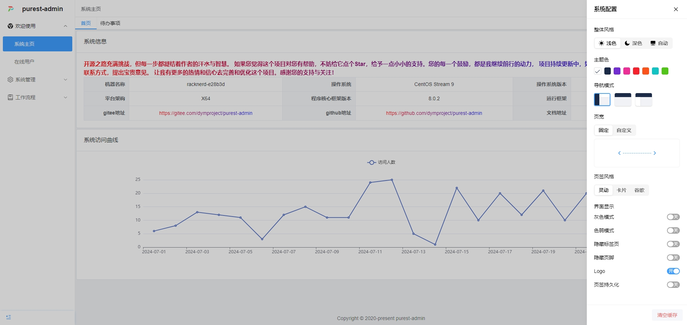

# 
Purest Admin

### 项目介绍

* PurestAdmin 是一款前后端分离的极简rbac权限管理系统。PurestAdmin旨在打造一款最适合中小型项目二次开发的权限管理系统，不做任何业务型的功能，尽量让基础部分做到下载即用，方便广大的开发者。

### 项目结构

*  **服务端** 使用.Net8开发，在abp框架的设计上进行了精简和改良，只保留了核心功能，重写了部分abp的功能。使用SqlSugar替代了传统的EFCore，效率更高，使用更方便
*  **vue客户端** 采用了高质量前端项目vue-pure-admin的精简版，该项目大版本更新不频繁，改动内容较少，非常好。框架额外引入了功能非常强大的vxe-table并使用了其内置的其他组件，给开发者更多的选择空间

### 设计思路

*  **服务端** 不再关心前端的任何实现，只针对功能，开放接口，同时通过“功能管理”，控制用户调用接口的的权限
*  **客户端** 无需再和服务端约定路由等相关内容，直接根据接口，获取功能编码，通过唯一的“功能编码”挂载路由以及控制界面功能

### 演示地址

- [http://www.purestadmin.com](http://www.purestadmin.com)
- 应用服务器在国外，数据库服务器在国内，可能查询数据会有略微延迟。并非项目本身的问题

### 文档地址

- [http://docs.purestadmin.com](http://docs.purestadmin.com)

### 完成功能

- 1、登陆验证
- 2、用户管理
- 3、角色管理
- 4、功能管理
- 5、组织机构
- 6、字典管理
- 7、配置管理
- 8、在线用户
- 9、请求日志
- 10、个人信息
- 11、通知公告

### 项目截图

| || |
|---|---|---|
|  |   |  |
|  |  | |

### 其他

* 开源之路充满挑战，但每一步都凝结着作者的汗水与智慧。 如果您觉得这个项目对您有帮助，不妨给它点个Star，给予一点小小的支持。您的每一个鼓励，都是我继续前行的动力， 项目持续更新中，如果您有任何问题，可通过文档中的联系方式，提出宝贵意见。 让我有更多的热情和信心去完善和优化这个项目。感谢您的支持与关注！

### 特别鸣谢
- 👉 ABP：  [https://docs.abp.io/zh-Hans/abp/latest](https://docs.abp.io/zh-Hans/abp/latest)
- 👉 SqlSugar：[https://gitee.com/dotnetchina/SqlSugar](https://gitee.com/dotnetchina/SqlSugar)
- 👉 IdGenerator：[https://github.com/yitter/idgenerator](https://github.com/yitter/idgenerator)
- 👉 Ip2region：[https://github.com/lionsoul2014/ip2region](https://github.com/lionsoul2014/ip2region)
- 👉 vue-pure-admin：[https://gitee.com/yiming_chang/vue-pure-admin](https://gitee.com/yiming_chang/vue-pure-admin)
- 👉 vxe-table：[https://gitee.com/xuliangzhan_admin/vxe-table](https://gitee.com/xuliangzhan_admin/vxe-table)
- 👉 有幸使用、未能一一在此列举的框架以及好朋友们

