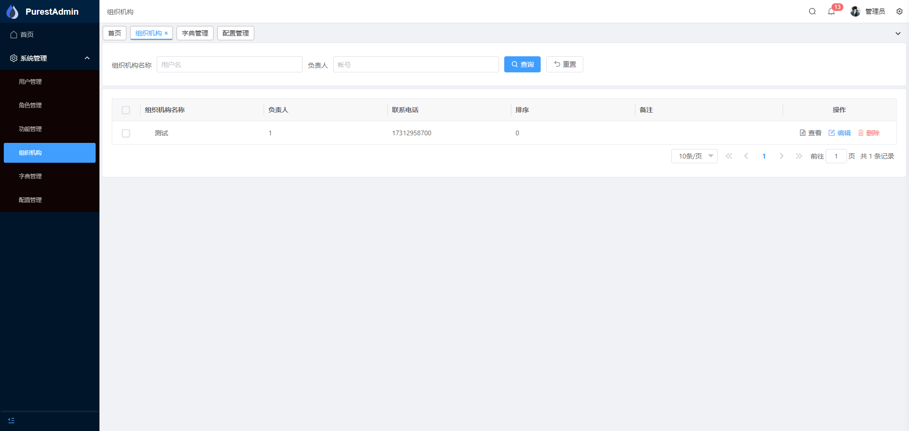
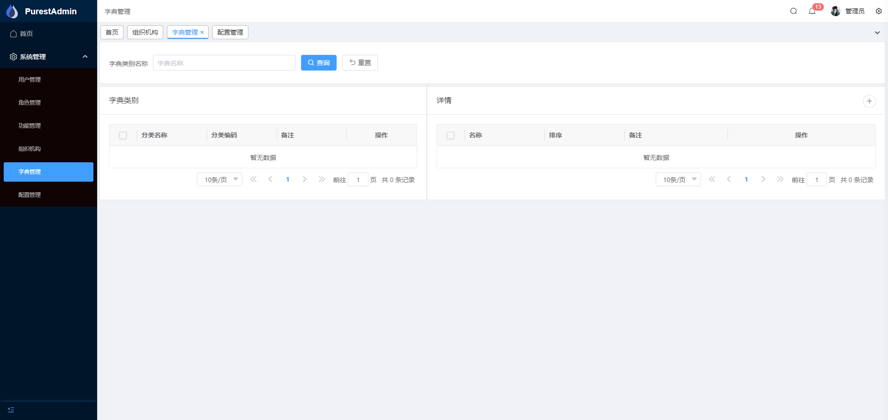
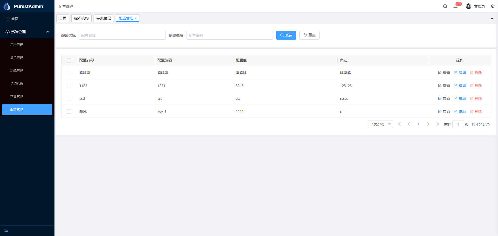
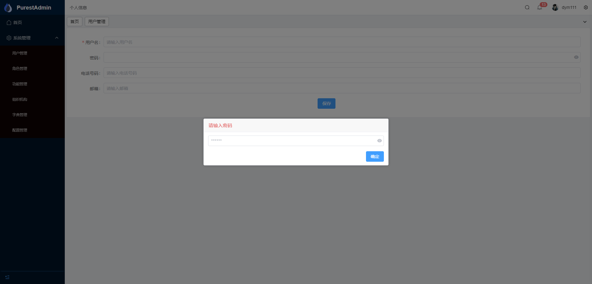

# PurestAdmin

#### 介绍
* 基于.NET 8 + vue3 实现的极简rabc权限管理系统后端
* 后端基于Furion框架，前端框架基于vue-pure-admin、表格框架vxe-table更方便移植
* 项目dbfirst模式，使用powerdesigner设计数据模型，更符合大多数的开发者
* ORM使用SqlSugar，默认mysql，有其他需要可自行替换（很简单）
* 核心功能包括最常见的：用户管理、角色管理、组织机构管理、字典管理、等基本功能，后续会根据反馈进行相关维护

#### 开源初衷

* 1、从业也算是很多年了，磕磕绊绊的总算立足于社会，成家立业。在这漫长的职业生涯里，一直感受到的是行业的温暖。有同事朋友们的帮助和关怀，还有开源大佬们对知识的无私奉献，所以希望能把行业的温暖传播给更多的人
* 2、现有的很多优秀的开源项目，并不复合我的设计思路（重度强迫症），看一看有多少和我一样的 :smiley: ，如果你觉得项目还行，请给个star吧

#### 设计思路

先说说现有的前后端分离系统，大多数其实在我看来都是（假）分离。尤其是菜单及按钮权限这个部分，在此不再赘述。说一下我的设计思路：
* 1、后端不再关心前端的任何实现，只针对功能，开放接口，不再关心菜单按钮等前端问题，降低耦合，同时，可以通过功能模块，控制其他使用者（比如第三方的调用）的权限
* 2、前端根据功能接口、实现想要的功能，所有的业务点由后端控制
* 表现为：把传统的菜单、按钮这些以功能的形式剥离开，后端不再关心前端的按钮、菜单问题，前端通过功能接口，设计自己的路由以及权限控制。

#### 演示地址

- http://dev.purestadmin.com:8015  admin/123456 

#### 基本功能

- 1、登陆
- 2、用户管理
- 3、角色管理
- 4、功能管理
- 5、组织机构
- 6、字典管理
- 7、配置管理
- 8、文件管理（提供了文件上传下载接口）
- 9、日志模块（日志氛围很多种，这里只引用了系统日志，生成日志文件，在根目录下的log文件夹）

- 项目的具体思路已经体现了。有兴趣可以pr哦

#### 未来规划

- 1、界面的主题模式匹配（引入了vxe-table，而且擅自修改了部分界面构成的css，所以需要弄一下）
 

#### 特别注意
 - **由于后端使用的Furion文档开始收费了，后面可能会寻找一个替代的框架。比如.NetAspire（学习中）、abpvnext等，在此期间，项目后端不再进行新功能的开发以及维护了，直到下一个替代的项目完整对接现在的前端**

#### 截图

|   |   |   |
|---|---|---|
|  |  |  |
||---|---|
|---|---|---|

#### 如何使用

前端建议使用pnpm,clone之后 install（需要node环境，版本16+，这句话主要是写给纯后端小伙伴）

* 前端文档传送门 [Pure Admin 保姆级文档](https://yiming_chang.gitee.io/pure-admin-doc/pages/introduction) 
* 后端文档传送门 [Furion 让 .NET 开发更简单，更通用，更流行](http://furion.baiqian.ltd)

#### 特别鸣谢
- 👉 Furion：  [https://dotnetchina.gitee.io/furion](https://dotnetchina.gitee.io/furion)
- 👉 SqlSugar：[https://gitee.com/dotnetchina/SqlSugar](https://gitee.com/dotnetchina/SqlSugar)
- 👉 IdGenerator：[https://github.com/yitter/idgenerator](https://github.com/yitter/idgenerator)
- 👉 vue-pure-admin：[https://gitee.com/yiming_chang/vue-pure-admin](https://gitee.com/yiming_chang/vue-pure-admin)
- 👉 vxe-table：[https://gitee.com/xuliangzhan_admin/vxe-table](https://gitee.com/xuliangzhan_admin/vxe-table)
- 👉 有幸使用过、未能一一在此列举的框架以及好朋友们

#### 其他
如有其他问题、请私信或者留言
