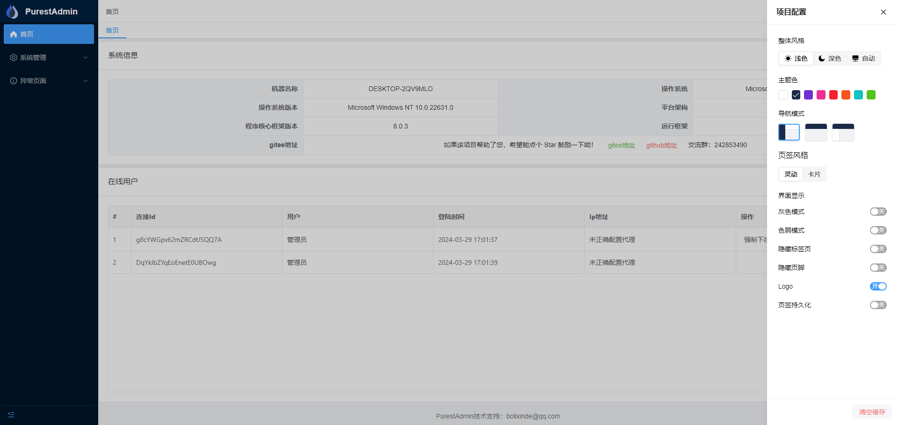
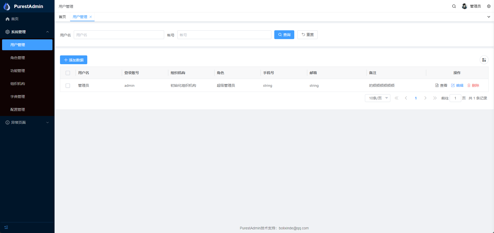
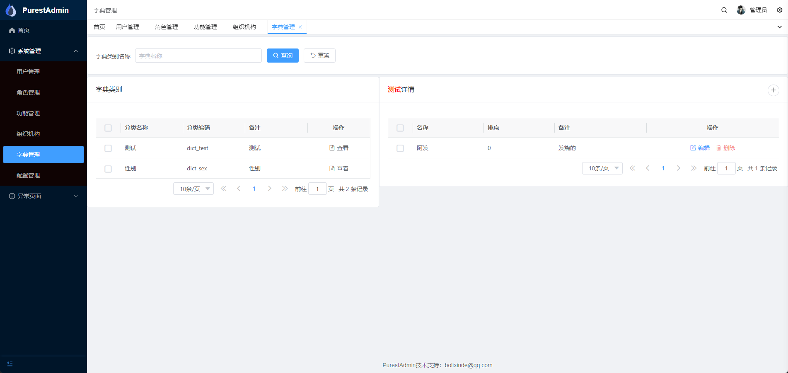
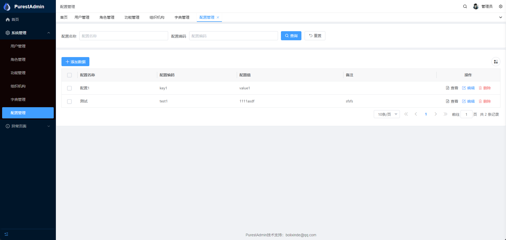

<h1>Purest Admin</h1>

<h2>打造一款最适合进行二开的极简.Net框架</h2>

#### 介绍
* 基于 .NET 8 + vue3 实现的极简rabc权限管理系统后端
* 后端基于精简后的abp框架，前端基于vue-pure-admin，前端表格框架vxe-table
* 项目采用dbfirst模式，使用powerdesigner设计数据模型
* 后端ORM使用.net届最受欢迎的框架：SqlSugar，且文档永久免费
* 核心功能包括最常见的：用户管理、角色管理、组织机构管理、字典管理、等基本功能

#### 开源初衷

* 1、在这漫长的职业生涯里，一直感受到的是行业的温暖。有同事朋友们的帮助和关怀，还有大佬们对知识的无私奉献，所以希望能把行业的温暖传播给更多的人
* 2、现有的很多优秀的开源项目，并不复合我的设计思路， 而且大多的项目太臃肿了，更有甚者需要付费解锁高级功能
* 3、想要打造一个最适合二次开发的.Net管理模板，让用户尽快投入到业务的开发中去，如果你觉得项目对您有帮助，请给个star吧

#### 设计思路

先说说现有的前后端分离系统，大多数其实在我看来都是（假）分离。尤其是菜单及按钮权限这个部分，在此不再赘述。说一下我的设计思路：

* 1、后端不再关心前端的任何实现，只针对功能，开放接口，不再关心菜单按钮等前端问题，降低耦合，同时，可以通过功能模块，控制其他使用者（比如第三方的调用）的权限
* 2、前端根据功能接口、实现想要的功能，所有的业务点由后端控制

* 表现为：把传统的菜单、按钮这些以功能的形式剥离开，后端不再关心前端的按钮、菜单问题，前端通过功能接口，设计自己的路由以及权限控制。

#### 框架结构

这里主要介绍后端结构，前端参照原作者保姆式文档。项目修改了abp的项目结构，使其更加精简，不必为了设计而设计，也不用生搬硬套各种模式了。后端项目主要就是一个作用，提供前端所需要的接口！

* PurestAdmin.Api.Host  项目入口、启动层，所有关于接口的设置都放在这里,比如请求中间件、授权策略等
* PurestAdmin.Application 应用层，会自动根据规则生成api接口，业务层
* PurestAdmin.Core 核心层，项目中所有层都要依赖此层，此层不参与任何业务内容，只负责外部package的引用，以及组件的封装、扩展等
* PurestAdmin.Multiplex 复合层，多元化的层，作用：为application和host层提供价值，别的层不合适存放的东西都可以放在这一层（比如获取当前用户、枚举等）
* PurestAdmin.Multiplex.Contracts 复合层的契约层，这里定义的接口需要在Multiplex层实现，相当于复合层方法的抽象层
* PurestAdmin.SqlSugar ORM层，存放实体和扩展实体

#### 演示地址

- http://198.23.254.120
- 演示环境去掉了相关接口权限验证

#### 功能
 ##### 前端可视界面
- 1、登陆
- 2、用户管理
- 3、角色管理
- 4、功能管理
- 5、组织机构
- 6、字典管理
- 7、配置管理
- 8、在线用户
- 9、请求日志
- 10、个人信息
##### 后端第三方集成
- 1、orm（SqlSugar）
- 2、雪花Id集成(yitter/idgenerator)
- 3、Ip2region（lionsoul2014/ip2region）

#### 如何使用
* frontend 存放前端项目，建议使用pnpm,clone之后 install（需要node环境，版本16+）,项目自己封装了vxe-table，不一定适合所有人，可自行替换。
* backend 存放后端项目，项目结构已经重新划分，和abp已经不一样了，参照框架结构介绍
* pmd 存放数据模型以及初始化sql文件，mysql数据库，导入数据前请先创建数据库（CREATE DATABASE PUREST)，如果想使用现有的数据库，请记得修改连接字符串

* 前端文档传送门 [Pure Admin 保姆级文档](https://yiming_chang.gitee.io/pure-admin-doc/pages/introduction) 
* 后端文档传送门 [ABP 文档](https://docs.abp.io/zh-Hans/abp/latest/Tutorials/Todo/Index?UI=NG&DB=EF)
* SqlSugar [SqlSugar .Net ORM 5.X 官网 、文档、教程](https://www.donet5.com/Home/Doc)

#### 未来规划

- 继续完善一些常用且不掺杂业务的基本功能
- 完善一下二开的使用文档（因为关注的人不多，也没得到过什么反馈，暂时默认大家都能理解并完全上手了）

-  **开发一版wpf的前端(开发中)** 

#### 截图

| || |
|---|---|---|
|  |   |  |
|  |  | |

#### 特别鸣谢
- 👉 ABP：  [https://docs.abp.io/zh-Hans/abp/latest](https://docs.abp.io/zh-Hans/abp/latest)
- 👉 SqlSugar：[https://gitee.com/dotnetchina/SqlSugar](https://gitee.com/dotnetchina/SqlSugar)
- 👉 IdGenerator：[https://github.com/yitter/idgenerator](https://github.com/yitter/idgenerator)
- 👉 Ip2region：[https://github.com/lionsoul2014/ip2region](https://github.com/lionsoul2014/ip2region)
- 👉 vue-pure-admin：[https://gitee.com/yiming_chang/vue-pure-admin](https://gitee.com/yiming_chang/vue-pure-admin)
- 👉 vxe-table：[https://gitee.com/xuliangzhan_admin/vxe-table](https://gitee.com/xuliangzhan_admin/vxe-table)
- 👉 有幸使用、未能一一在此列举的框架以及好朋友们

#### 其他
如有其他问题、请私信或者留言
