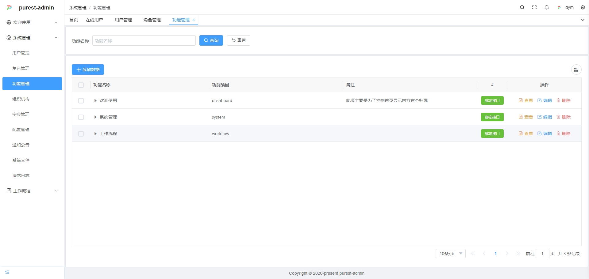

# 
Purest Admin

### 项目介绍

Purest Admin 是一套真正意义上前后端分离、深度适配企业RBAC权限体系的通用后台管理系统。依托现代化 .NET 10 技术栈、Vue3 生态前端、强大的工作流引擎，力求降低业务框架搭建门槛，实现一站式、敏捷、高可扩展的企业级后台管理平台。

### 项目结构

*  **Api** 后端接口项目，使用.Net8开发，在abp框架的设计上进行了精简和改良，只保留了核心功能，重写了部分abp的功能。使用SqlSugar替代了传统的EFCore，效率更高，使用更方便
*  **client-uni** uniapp客户端项目（开发中）
*  **client-vue** 这里包含两个vue前端框架，一个是pure-admin，一个是vben-admin，基础功能都已完成。pure-admin没有国际化功能，vben-admin带国际化功能，可自行选用
*  **client-wpf** wfp客户端项目，prism+rubyerUI+restflul构成，仅完成了项目搭建以及登录
*  **relationship-model** 关系模型，数据库关系模型图，基于navicat设计的模型图，以及对应的表结构初始化SQL，只存放了Mysql的。如果需要其他库支持，需要自行转换
*  **screenshot** 项目截图

### 设计思路

*  **服务端** 不再关心前端的任何实现，只针对功能，开放接口，同时通过“功能管理”，控制用户调用接口的的权限
*  **客户端** 无需再和服务端约定路由等相关内容，直接根据接口，获取功能编码，通过唯一的“功能编码”挂载路由以及控制界面功能

### 演示地址

- [http://www.purestadmin.com](http://www.purestadmin.com)
- 用户名/密码：admin/123456

### 文档地址

- [http://docs.purestadmin.com](http://docs.purestadmin.com)
- 文档提供本项目的结构说明以及再次开发中需要的注意事项，记录常见问题以及相关处理方式

### 完成功能

- 1、登陆登录以及权限验证
- 2、系统管理（组织架构、用户、角色、权限、功能、字典、配置等）
- 3、工作流程（表单设计、流程设计、待办事项等）
- 4、OAuth2.0登录接入（gitee,gitee）

* wpf版本只完成了框架的构造以及登录等基本功能（暂时不打算继续开发了），如果您有兴趣，请联系我一起吧。
* 工作流部分只提供了比较简单的入门级示例。请根据需求自行二开。

### 后续内容

- uniapp的持续接入

### 项目截图

| | ||
|---|---|---|
|  |   |  |
|  |  | |
|  |  | |
|  |  | |
|  |  | |

### 其他

* **开源之路充满挑战，但每一步都凝结着作者的汗水与智慧。 如果您觉得这个项目对您有帮助，不妨给它点个Star，给予一点小小的支持。您的每一个鼓励，都是我继续前行的动力， 项目持续更新中，如果您有任何问题，可通过文档中的联系方式，提出宝贵意见。 让我有更多的热情和信心去完善和优化这个项目。感谢您的支持与关注！** 

### 特别鸣谢
- 👉 ABP：  [https://docs.abp.io/zh-Hans/abp/latest](https://docs.abp.io/zh-Hans/abp/latest)
- 👉 SqlSugar：[https://gitee.com/dotnetchina/SqlSugar](https://gitee.com/dotnetchina/SqlSugar)
- 👉 IdGenerator：[https://github.com/yitter/idgenerator](https://github.com/yitter/idgenerator)
- 👉 Ip2region：[https://github.com/lionsoul2014/ip2region](https://github.com/lionsoul2014/ip2region)
- 👉 vue-pure-admin：[https://gitee.com/yiming_chang/vue-pure-admin](https://gitee.com/yiming_chang/vue-pure-admin)
- 👉 vue-vben-admin：[https://github.com/vbenjs/vue-vben-admin)
- 👉 rubyer-wpf：[https://gitee.com/wuyanxin1028/rubyer-wpf](https://gitee.com/wuyanxin1028/rubyer-wpf)
- 👉 Flurl：[https://github.com/tmenier/Flurl](https://github.com/tmenier/Flurl)
- 👉 workflow-core：[https://github.com/danielgerlag/workflow-core](https://github.com/danielgerlag/workflow-core)
- 👉 vben: [https://doc.vben.pro](https://doc.vben.pro)
- 👉 uniapp: [https://www.dcloud.io](https://www.dcloud.io/)
- 👉 以上排名不分先后，还包括有幸使用、未能一一在此列举的框架以及好朋友们
